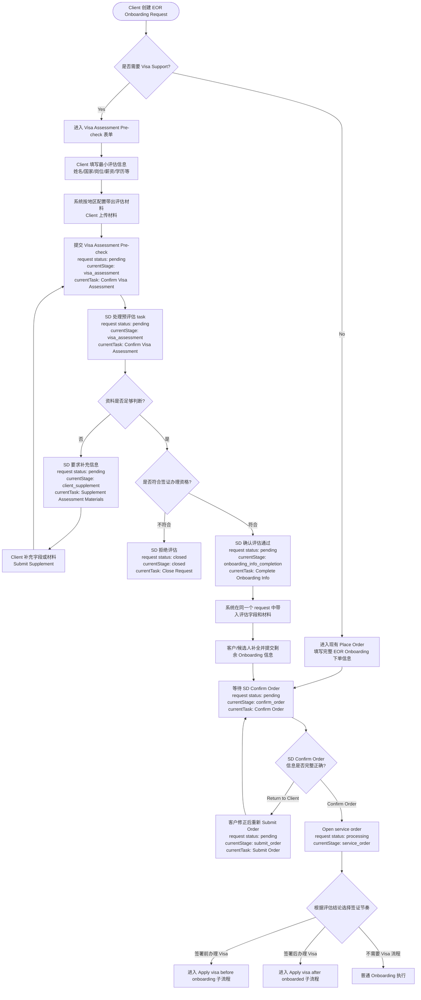

# 产品方案：Support Visa Assessment Pre-check Flow

***

> 知识来源：backup/04\_spec/（knowledgebase 尚未就绪）
>
> 需求来源：`01_requirement_description/Butter/epic-eor/feature-visa-assessment-precheck/2026-05-15_IRP-331_Visa_Assessment_Pre-check_Flow.md`

## 1. 方案概述

当前 EOR 2.0 Onboarding 的下单链路中，客户在创建正式 onboarding request 时需要同时提交候选人入职信息和 visa 判断信息。服务团队在接单阶段再确认候选人是否需要签证、是否可办理，以及 visa 应放在签署前还是签署后。这种模式在候选人签证资格不明确时，会让客户提前填写较多完整 onboarding 信息，也可能产生后续无法办理签证但 request 已经创建的无效流程。

本方案在 EOR Onboarding request 的正式接单前增加 **Visa Assessment Pre-check** 轻量评估流程：

- 客户点击创建 EOR Onboarding request 后，先选择候选人是否需要 visa support。
- 如果不需要 visa support，沿用现有普通 onboarding 下单流程。
- 如果需要 visa support，同一个 request 先进入签证预评估阶段，只收集评估所需最小信息和附件材料。
- SD 在该 request 的预评估 task 中审核资格和材料，必要时要求客户补充。
- SD 确认候选人符合签证办理资格后，该 request 继续进入 onboarding 信息补全、Submit Order 和 Confirm Order。
- 若评估不通过，则关闭该 request，不进入正式 EOR onboarding 接单。

方案核心原则是：**评估阶段只判断签证资格，不启动正式 work visa application，也不要求客户填写完整 onboarding 信息。**

***

## 2. 目标用户与业务价值

| 角色                | 业务价值                                          |
| ----------------- | --------------------------------------------- |
| Client HR / 客户联系人 | 在签证资格不确定时，只需提交少量关键信息和材料，降低提交流程门槛              |
| SD                | 在正式 onboarding 前完成签证可行性判断，减少后续流程回退和无效 request |
| LS / 本地支持角色       | 可在评估阶段提前参与当地签证规则判断，避免合同/入职阶段才发现不可办理           |
| 产品 / 运营           | 将签证风险前置，提升正式 onboarding request 的有效性和流程质量     |

***

## 3. 功能模块

### 3.1 创建 request 时的 visa support 分流

在客户创建 EOR Onboarding request 的入口增加 visa support 判断：

| 客户选择                               | 系统处理                                                   |
| ---------------------------------- | ------------------------------------------------------ |
| `No, visa support is not required` | 进入现有 EOR Onboarding `Place Order` 下单流程，不改变原有字段和接单逻辑      |
| `Yes, visa support is required`    | 同一个 request 进入 Visa Assessment Pre-check 表单，正式接单前先完成评估 |

### 3.2 Visa Assessment Pre-check 表单

评估表单只收集签证资格判断所需的最小字段。字段应支持后续按国家/地区、签证类型配置，本期可先使用默认字段集。

建议默认字段：

| 字段                        | 必填建议 | 说明                          |
| ------------------------- | ---- | --------------------------- |
| Candidate Name            | 必填   | 候选人姓名，用于预评估和后续 candidate 记录 |
| Candidate Email           | 建议必填 | 用于后续 onboarding 或补料沟通       |
| Work Location             | 必填   | 判断目标国家/地区签证要求               |
| Nationality / Citizenship | 必填   | 判断签证资格的重要条件                 |
| Current Location          | 必填   | 判断是否可境内/境外申请                |
| Job Title / Position      | 必填   | 判断岗位是否满足签证要求                |
| Salary                    | 必填   | 判断是否满足最低薪资或岗位等级要求           |
| Degree / Education Level  | 必填   | 判断学历资质要求                    |
| Expected Start Date       | 建议必填 | 判断签证周期是否影响入职计划              |
| Visa Type / Visa Scope    | 可选   | 客户已知时填写；不确定时由 SD 判断         |
| Remark                    | 可选   | 客户补充说明特殊情况                  |

材料上传规则：

Butter 底层已根据地区预设了各地区签证评估所需材料，因此本方案不新增独立材料清单维护。客户在评估表单中选择目标工作国家/地区及相关签证范围后，系统根据现有地区材料配置自动带出需要上传的评估材料。

| 规则项    | 处理逻辑                                           |
| ------ | ---------------------------------------------- |
| 材料清单来源 | 复用 Butter 现有按地区预设的签证评估材料配置                     |
| 带出时机   | 客户选择或变更 `Work Location` 后，系统刷新对应材料清单           |
| 必填规则   | 按现有地区材料配置中的 required / optional 规则展示和校验        |
| 材料展示   | 展示材料名称、是否必填、说明或样例要求；若底层配置支持签证类型维度，则结合签证类型进一步过滤 |
| 配置缺失   | 若目标地区没有预设材料配置，系统提示暂无预设清单，并允许 SD 在评估阶段要求补充材料    |
| 补料处理   | SD 可基于评估结果要求客户补充系统已带出但未上传的材料，或补充额外材料           |

### 3.3 Request 状态与预评估阶段管理

本期建议不新增一套独立的 Visa Assessment request status，也不把 `Approved / Rejected / Need More Information` 扩展为 Butter 顶层 request status。顶层 request status 仍沿用 Butter 现有状态，用于表达 request 是否已经被正式接单；签证预评估和后续接单前流程通过 `currentStage`、`currentTask` 表达。

顶层 request status 建议语义如下：

| Request Status | 合并后语义                                                                               |
| -------------- | ----------------------------------------------------------------------------------- |
| `pending`      | 尚未完成正式 EOR onboarding 接单。包括等待签证预评估、预评估补料、预评估通过后补全 onboarding 信息、等待 SD Confirm Order |
| `processing`   | SD 已完成正式 `Confirm Order`，并已 `Open service order`，request 进入正式 EOR onboarding 执行     |
| `revoked`      | 在进入 `processing` 前，客户撤回整个 request                                                   |
| `canceled`     | 进入 `processing` 后，客户或服务团队取消 request                                                 |
| `closed`       | 服务范围不支持、长期无响应或其他原因导致 request 非正常关闭                                                  |
| `completed`    | 正式 EOR onboarding 服务完成                                                              |

为区分不同 `pending` 阶段，建议增加或复用以下业务字段：

| 字段             | 建议值                                                                                                                             | 说明                |
| -------------- | ------------------------------------------------------------------------------------------------------------------------------- | ----------------- |
| `currentStage` | `visa_assessment` / `client_supplement` / `onboarding_info_completion` / `submit_order` / `confirm_order` / `service_order`     | 当前 request 所处业务阶段 |
| `currentTask`  | `Confirm Visa Assessment` / `Supplement Assessment Materials` / `Complete Onboarding Info` / `Submit Order` / `Confirm Order` 等 | 列表和详情页展示的当前待办     |

状态规则：

- 客户提交签证预评估后，request status 为 `pending`，`currentStage = visa_assessment`，`currentTask = Confirm Visa Assessment`。
- SD 开始处理预评估 task 后，request status 仍保持 `pending`，`currentStage = visa_assessment`，`currentTask = Confirm Visa Assessment`。
- SD 要求客户补充字段或材料时，request status 仍保持 `pending`，`currentStage = client_supplement`，`currentTask = Supplement Assessment Materials`。
- 客户补充并重新提交后，request status 仍保持 `pending`，`currentStage = visa_assessment`，`currentTask = Confirm Visa Assessment`。
- SD 评估通过后，request status 仍保持 `pending`，`currentStage = onboarding_info_completion`，`currentTask = Complete Onboarding Info`。
- 客户或候选人补全并提交 onboarding 信息后，request status 仍保持 `pending`，`currentStage = confirm_order`，`currentTask = Confirm Order`。
- SD 在 `Confirm Order` 阶段发现候选人信息有问题时，可以 Return to Client；request status 仍保持 `pending`，`currentStage = submit_order`，`currentTask = Submit Order`。
- 只有 SD 完成正式 `Confirm Order` 并进入 `Open service order` 后，request status 才从 `pending` 变为 `processing`。
- 进入正式服务执行后，request status 为 `processing`，`currentStage = service_order`，`currentTask` 展示当前服务执行节点。

### 3.4 SD 评估与确认

SD 在 request 详情页的预评估 task 中完成以下动作：

- 查看客户提交的评估字段和附件。
- 要求客户补充字段或材料，并填写补充原因。
- 给出评估结论：
  - `Approved`：符合签证办理资格，可进入正式 onboarding。
  - `Return to Client`：当前资料不足，无法判断。
  - `Close Request`：不符合签证办理资格、不在服务范围内或无法继续推进。

评估结论应记录：

- 评估结果
- 结果原因 / 备注
- 评估确认人和确认时间

### 3.5 评估通过后进入 onboarding 信息补全与接单

当 SD 在 `Confirm Visa Assessment` task 中确认预评估通过时，不再创建另一个正式 onboarding request，而是让同一个 request 进入后续 onboarding 信息补全、Submit Order 和 Confirm Order。

流转规则：

- 将评估阶段已填写字段映射到同一个 request 的 onboarding candidate 信息中。
- 将评估阶段根据地区配置上传的附件关联到同一个 request 的文档区，并保留来源标记。
- 客户或候选人继续补全剩余 onboarding 必填信息。
- 客户或候选人补全并提交 onboarding 信息后，request 进入 `Confirm Order`，等待 SD 正式接单。
- SD 在 `Confirm Order` 阶段复核完整下单信息、评估结论、签证节奏、合同/offer 路径和服务承接责任。
- SD 确认接单并执行 `Open service order` 后，request status 从 `pending` 变为 `processing`。

覆盖规则：

- 如果 onboarding 信息中对应字段为空，则自动带入评估字段。
- 如果客户在后续 onboarding 信息补全中修改已带入字段，系统保留最新值，并在 Confirm Order 阶段提示 SD 复核差异。
- 评估结果和评估备注不应被客户覆盖，作为 SD 判断记录保留。

### 3.6 通知与可见性

| 事件                       | 通知对象        | 说明                                |
| ------------------------ | ----------- | --------------------------------- |
| 客户提交预评估信息                | SD          | 提醒 SD 处理新的预评估 task                |
| SD 要求补充信息                | Client      | 告知需补充字段/材料和原因                     |
| 客户补充后重新提交                | SD          | 提醒 SD 继续评估                        |
| 预评估不通过并关闭 request        | Client      | 告知关闭原因和后续建议                       |
| 预评估通过并进入 onboarding 信息补全 | Client / SD | 告知该 request 可继续补全正式 onboarding 信息 |
| SD 完成 Confirm Order      | Client / SD | 告知 request 已正式接单并进入服务执行           |

Client 可查看自己提交的 request 状态、预评估材料和预评估结果；SD 可查看其权限范围内的 request；LS 是否可见取决于预评估 task 是否分配给 LS 或当地角色。

### 3.7 合并后的 Request Flow 节点规划

签证预评估合并进同一个 EOR Onboarding request 后，request flow 建议先在入口做 `Visa Support Decision` 分流：不需要 visa support 的 request 继续走原有 `Place Order`；需要 visa support 的 request 不进入原有完整 `Place Order`，而是先走 `Visa Assessment Pre-check`。

| Flow 节点                           | 主要处理人              | 进入条件                                   | 完成动作 / 分支                                                                              | Request Status                      |
| --------------------------------- | ------------------ | -------------------------------------- | -------------------------------------------------------------------------------------- | ----------------------------------- |
| `Visa Support Decision`           | Client             | Client 创建 EOR Onboarding request       | 选择 No 进入 `Place Order`；选择 Yes 进入 `Visa Assessment Pre-check`                           | `pending`                           |
| `Place Order`                     | Client             | Client 选择不需要 visa support             | 填写完整 EOR onboarding 下单信息，进入 `Confirm Order`                                           | `pending`                           |
| `Visa Assessment Pre-check`       | Client             | Client 选择需要 visa support               | 填写预评估字段并上传评估材料                                                                         | `pending`                           |
| `Confirm Visa Assessment`         | SD / LS            | Client 提交预评估信息                         | Approved / Return to Client / Close Request                                            | `pending`，Close Request 时转 `closed` |
| `Supplement Assessment Materials` | Client             | SD 要求补充                                | Client 补充字段或材料后重新提交                                                                    | `pending`                           |
| `Complete Onboarding Info`        | Client / Candidate | 预评估通过                                  | 补全并提交剩余 onboarding 字段和材料，进入 `Confirm Order`                                            | `pending`                           |
| `Confirm Order`                   | SD                 | Client / Candidate 已提交正式 onboarding 信息 | Return to Client / Confirm Order / Cancel or Close；Return to Client 后回到 `Submit Order` | `pending`，确认接单后准备转 `processing`     |
| `Submit Order`                    | Client             | SD 从 Confirm Order 打回                  | 修正信息后重新提交正式接单确认                                                                        | `pending`                           |
| `Open Service Order`              | System / SD        | SD 完成 Confirm Order                    | 创建或打开后续服务执行节点                                                                          | `processing`                        |
| `Complete Order`                  | SD / System        | 服务执行完成                                 | 完成整个 request                                                                           | `completed`                         |
| `Revoke Order`                    | Client             | `Open Service Order` 前撤回               | 撤回整个 request                                                                           | `revoked`                           |
| `Cancel Order`                    | Client / SD        | 取消                                     | 取消 request                                                                             | `canceled`                          |
| `Close Request`                   | SD / System        | 服务范围不支持、长期无响应等                         | 非正常完成关闭                                                                                | `closed`                            |

关键规则：

- `Confirm Visa Assessment` 是正式接单前的前置 task，不应把顶层 request status 改为 `processing`。
- `Confirm Order` 仍是 EOR Onboarding 的正式接单节点。
- `Open Service Order` 是顶层 status 从 `pending` 转为 `processing` 的边界。
- 列表页只展示 `Request Status` 和 `Pending Task`；操作按钮统一为 `View`，具体处理入口进入 Request Info 后由当前 records 节点的 `Process` 按钮承载。

界面交互细则独立维护，详见：`docs/2026-05-15_IRP-331_Visa_Assessment_Pre-check_交互细则.md`。

***

## 4. 核心业务流程 (Mermaid)

***

## 5. 覆盖场景

### 5.1 正常场景

| 场景                   | 方案处理逻辑                                                                                                                                  |
| -------------------- | --------------------------------------------------------------------------------------------------------------------------------------- |
| 客户确认不需要签证支持          | 直接进入现有 EOR Onboarding 下单流程，不受本需求影响                                                                                                      |
| 客户确认需要签证支持           | 同一个 request 先进入 Visa Assessment Pre-check，只填写评估字段，并按地区预设材料清单上传评估材料                                                                      |
| SD 评估通过              | request status 仍为 `pending`，`currentStage = onboarding_info_completion`，`currentTask = Complete Onboarding Info`，系统在同一个 request 中带入评估字段 |
| 后续 onboarding 继续补全信息 | 客户/候选人只补充剩余 onboarding 必填信息，不重复填写已带入字段；补全并提交后进入 `currentStage = confirm_order`，`currentTask = Confirm Order`                            |
| SD 正式 Confirm Order  | SD 复核预评估结论、完整 onboarding 信息和服务路径，接单后 request status 变为 `processing`                                                                     |

### 5.2 异常与边界场景

| 场景                       | 方案处理逻辑                                                                                                                          |
| ------------------------ | ------------------------------------------------------------------------------------------------------------------------------- |
| 评估字段或材料不足                | SD 退回客户补充，request status 仍为 `pending`，`currentStage = client_supplement`，`currentTask = Supplement Assessment Materials`        |
| 候选人不符合签证办理资格             | SD 填写拒绝原因，request status 变为 `closed`，`currentStage = closed`，`currentTask = Close Request`                                      |
| 客户评估阶段选择错误 Project       | SD 可要求客户修改并进入 `currentStage = client_supplement`；如不在服务范围，则 Close Request                                                        |
| SD 接单时发现 onboarding 信息有误 | SD 在 `Confirm Order` 阶段 Return to Client，request status 仍为 `pending`，`currentStage = submit_order`，`currentTask = Submit Order` |
| 评估通过后客户修改关键字段            | 后续 onboarding 信息允许修改，但需保留评估字段来源和差异提示，SD 接单时复核                                                                                   |
| 评估通过后不继续 onboarding      | request 保持 `pending`，可由客户撤回为 `revoked`，或由 SD 按业务规则关闭为 `closed`                                                                  |
| LS 需要参与评估                | SD 将预评估 task 分配/共享给 LS，LS 提供评估意见，SD 给出最终结果                                                                                      |
| 客户不确定是否需要 visa           | 若本期支持 `Not sure`，按需要评估处理；若不支持，则引导客户选择 Yes 后评估                                                                                   |

***

## 6. 与现有 EOR Onboarding 流程的关系

本方案不替换现有 EOR Onboarding 主流程，而是在同一个 request 的正式接单前增加一个轻量前置判断层。

现有流程中的以下能力继续保留：

- 正式 onboarding 下单字段与候选人信息收集能力。
- Confirm Order 阶段对信息完整性、服务范围、责任人和流程路径的确认。
- `Apply visa before onboarding` 与 `Apply visa after onboarded` 两类签证子流程。
- 合同/offer 路径选择和后续服务执行流程。

本方案新增的变化：

- 涉及签证的客户不再直接进入完整 onboarding 下单，而是让同一个 request 先进入签证预评估阶段。
- 评估阶段不启动正式签证申请，不进入付款、申请进度、签证结果上传等节点。
- 评估通过后，同一个 request 中的 onboarding 信息补全会带入评估字段和评估结论，降低 Confirm Order 阶段重复判断成本。
- 顶层 request status 在正式 `Confirm Order / Open service order` 前保持 `pending`；签证预评估和补全进度通过 `currentStage` 和 `currentTask` 表达。

***

## 7. 设计约束与假设

- 本期聚焦 EOR Onboarding 场景，不扩展到 GPO、Contractor 或 Global Visa 独立下单。
- 本期评估对象默认是一名候选人；批量候选人评估可作为后续增强。
- 评估字段集本期可先采用默认配置，后续再按国家/地区、签证类型配置化；评估材料清单直接复用 Butter 已有的地区预设签证材料配置。
- SD 是评估结论的最终确认角色；LS 可参与评估，但是否开放 LS 端入口需结合现有权限和任务分配规则确认。
- 评估通过不代表签证一定获批，只代表候选人具备进入正式 onboarding 和后续签证办理流程的基础资格。
- 预评估通过后，同一个 request 仍需满足现有 onboarding 字段、合同/offer、付款和签证子流程要求。

***

## 8. 非功能要求

| 项目   | 要求                                                    |
| ---- | ----------------------------------------------------- |
| 可追溯性 | 同一个 request 中必须完整记录评估提交、补料、通过、拒绝、接单等节点                |
| 数据复用 | 评估字段和附件应带入后续 onboarding 信息补全和文档区，减少重复填写               |
| 权限隔离 | Client 只能查看本企业 request；SD 按现有服务范围查看；LS 按预评估 task 分配查看 |
| 审计记录 | 记录评估提交、补料、通过、拒绝、正式接单的操作人和时间                           |
| 兼容性  | 不影响不需要签证支持的现有 onboarding 下单流程                         |
| 文案语言 | Client 端和 SD 端文案沿用 Butter 英文业务文案风格                    |

***

## 9. 需求关联

- **Jira Issue**：[IRP-331](https://biposervice.atlassian.net/browse/IRP-331)
- **需求文档**：`01_requirement_description/Butter/epic-eor/feature-visa-assessment-precheck/2026-05-15_IRP-331_Visa_Assessment_Pre-check_Flow.md`
- **参考业务流程**：`backup/04_spec/Butter/epic-eor/feature-eor-onboarding/eor-2-0-onboarding-place-and-confirm-order-business-flow.md`
- **文档日期**：2026-05-15
