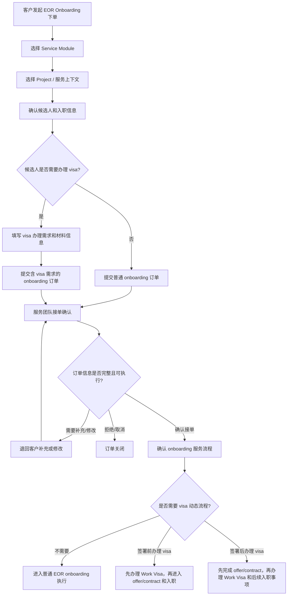

# EOR 2.0 Onboarding 下单与接单业务流程

本文档从业务视角梳理 EOR 2.0 Onboarding 中两个关键订单流程：

- `EoR Onboarding Place Order`：客户下单
- `EoR Onboarding Confirm Order`：服务团队接单确认

本文只描述业务流程、角色分工和业务判断，不描述前端、后端、接口或系统实现逻辑。

## 1. 业务目标

EOR 2.0 Onboarding 的下单与接单流程，本质上是在完成四件事：

1. 客户明确“本次要购买哪个服务模块，以及订单属于哪个 project”。
2. 客户明确“要为哪位候选人办理 EOR 入职”。
3. 客户明确“该候选人是否需要办理 visa，以及办理哪类 visa”。
4. 服务团队确认该订单是否可执行，并把订单转成具体的 EOR onboarding 服务流程。

因此，Place Order 更偏向客户提交需求；Confirm Order 更偏向服务团队确认需求、分配责任、选择执行路径。

## 2. 主要角色

| 角色        | 业务职责                                      |
| --------- | ----------------------------------------- |
| 客户联系人     | 发起 EOR onboarding 下单，提供候选人、入职、签证、备注和附件等信息 |
| 候选人       | 被办理入职的人，必要时补充个人资料、签证材料或签署相关文件             |
| SD        | 通常负责订单承接、客户沟通、候选人信息确认、服务流程推进              |
| LS        | 通常负责本地合规、签证、雇佣文件或当地执行事项支持                 |
| OC / 运营人员 | 在部分场景下负责订单确认、服务人员分配、异常订单处理                |

不同项目、国家/地区、服务包下，实际负责角色可能会有差异，但业务上都围绕“客户提交需求，服务团队确认并执行”展开。

## 3. 总体业务链路

## 4. EoR Onboarding Place Order：客户下单流程

### 4.1 流程定位

Place Order 是客户侧发起 EOR onboarding 的入口。

客户在这个阶段不需要决定完整的服务执行流程，但需要提供足够的信息，让服务团队能够判断订单是否能接、如何接，以及是否需要插入 visa 办理流程。

### 4.2 下单步骤

#### 第一步：选择 Service Module

客户首先需要选择本次要下单的服务模块。

在 EOR 2.0 onboarding 场景下，业务上需要明确：

- 本次订单属于 EOR 服务。
- 本次订单办理的是 Onboarding，而不是 Offboarding、Payroll、Contractor 或其他服务。
- 客户希望服务团队为候选人发起 EOR 入职服务。

这一步决定了订单进入 EOR onboarding 的业务域，也决定后续需要围绕候选人入职、合同/offer、visa、员工 onboarding 等事项展开。

#### 第二步：选择 Project / 服务上下文

客户需要选择本次订单所属的 project 或服务上下文。

业务上，这一步要回答的问题是：

- 该候选人属于哪个客户项目？
- 本次服务适用哪个国家/地区、服务包或客户服务安排？
- 后续由哪类服务团队承接，例如 SD、LS 或其他运营角色？
- 是否存在该 project 下已有的服务规则、联系人、付款安排或本地执行要求？

Project 的选择会影响后续接单判断，例如服务范围、服务团队分工、当地执行要求、visa 支持能力、合同/offer 路径和付款安排等。

如果 project 选择错误，后续即使候选人信息完整，也可能导致接单团队、服务流程或本地合规判断不准确。

#### 第三步：确认办理入职的候选人

客户需要选择或创建本次要办理 EOR 入职的候选人。

业务上，这一步要回答的问题是：

- 要为谁办理 EOR 入职？
- 候选人是否已经存在于系统中？
- 如果是新候选人，是否已经提供基本身份和联系信息？

常见信息包括：

- 候选人姓名
- 联系方式
- 所在国家/地区
- 预计入职国家/地区
- 候选人身份或证件相关信息
- 其他入职所需基础资料

如果一次需要为多个候选人办理入职，业务上也可以理解为“批量提交多个 onboarding 需求”。每位候选人都需要有相对独立的入职和 visa 判断。

#### 第四步：补充候选人入职信息

客户需要补充与 EOR 入职相关的信息。

业务上，这一步要回答的问题是：

- 候选人将在哪个国家/地区入职？
- 候选人入职后是什么岗位？
- 预计开始工作日期是什么？
- 薪酬、工作安排、项目归属是否明确？
- 是否有本地雇佣、合同、薪资或合规相关特殊要求？

常见信息包括：

- 岗位名称
- 工作国家/地区
- 预计开始日期
- 薪酬信息
- 工作地点或远程安排
- 所属项目或服务包
- 汇报关系或客户侧联系人
- 其他入职备注

这些信息会影响后续合同/offer 准备、雇佣合规判断、薪资设置和服务团队分工。

#### 第五步：确认是否需要办理 visa

这是 EOR 2.0 onboarding 下单中的关键分叉。

客户需要明确候选人是否需要 visa 支持。

如果不需要 visa：

- 客户选择不需要办理 visa。
- 订单后续按普通 EOR onboarding 需求提交。
- 服务团队接单时仍会复核该判断是否合理。

如果需要 visa：

- 客户选择需要办理 visa。
- 客户需要进一步说明 visa 办理范围和基本申请信息。
- 订单后续会进入含 visa 判断的接单确认流程。

#### 第六步：确认 visa 办理范围

当候选人需要办理 visa 时，客户需要说明具体办理类型。

常见类型包括：

| visa 办理范围     | 业务含义                                  |
| ------------- | ------------------------------------- |
| 只办理候选人本人工作签证  | 候选人本人需要 employment/work visa 才能合法工作   |
| 只办理家属签证       | 候选人的家属需要 dependant visa，候选人本人可能已有工作资格 |
| 本人工作签证 + 家属签证 | 候选人本人和家属都需要办理相关签证                     |

如果涉及家属签证，通常还需要提供家属申请人信息，例如：

- 家属姓名
- 与候选人的关系
- 家属证件或身份信息
- 家属签证类型
- 家属申请材料

如果本人工作签证和家属签证都需要办理，业务上通常会围绕主申请人的工作签证来安排节奏，家属签证是否同步或后置，需要接单时结合当地规则确认。

#### 第七步：补充 visa 申请信息

当候选人需要办理本人工作签证时，客户通常需要补充：

- 计划申请的 visa 类型
- 申请国家/地区或地点
- 候选人当前是否已经在签发国家/地区
- 候选人当前身份或已有签证情况
- 是否需要先做资格评估
- 是否已有必要材料
- 是否存在紧急入职时间要求

这些信息会影响服务团队判断：

- visa 能否办理
- 预计办理周期
- 是否会影响合同/offer 签署
- 是否会影响候选人实际入职日期
- 是否需要 LS 或本地供应商介入

#### 第八步：补充备注和附件

客户可以提供补充说明或上传附件。

常见场景包括：

- 候选人已有 offer 或合同草稿
- 客户已有内部审批文件
- 候选人已有护照、签证、居留许可等材料
- 该候选人的入职时间较紧急
- 该国家/地区有特殊合规要求
- 客户希望服务团队注意某些沟通事项

备注和附件不是形式项，而是服务团队判断订单是否可执行的重要补充信息。

#### 第九步：提交订单

客户提交后，订单进入待接单/待确认阶段。

此时业务含义是：

- 客户已经正式提出 EOR onboarding 服务需求。
- Service Module、Project、候选人和 visa 信息进入服务团队确认范围。
- 服务团队需要判断订单是否完整、是否可执行，以及后续走哪条服务流程。

## 5. EoR Onboarding Confirm Order：服务团队接单流程

### 5.1 流程定位

Confirm Order 是服务团队对客户下单内容进行业务确认的流程。

接单并不是简单地“接受订单”，而是要完成以下判断：

1. 信息是否完整。
2. 需求是否在服务范围内。
3. 候选人是否具备进入 onboarding 的条件。
4. visa 需求是否明确且可处理。
5. 后续应该走哪条 onboarding 服务流程。

### 5.2 接单步骤

#### 第一步：确认下单信息

服务团队首先确认客户提交的订单信息。

确认范围包括：

- 候选人信息
- 入职信息
- visa 信息
- 下单备注
- 附件材料
- 项目、国家/地区、服务包等背景信息

业务上，这一步要判断：

- 客户选择的服务模块是否确实为 EOR onboarding？
- 订单所属 project 是否正确？
- project 对应的服务范围、国家/地区和服务包是否支持本次需求？
- 候选人是否明确？
- 入职国家/地区是否明确？
- 预计入职时间是否合理？
- 岗位、薪酬、工作安排是否足够支持后续合同/offer 准备？
- 客户是否提供了必要材料？
- 是否存在明显缺失、冲突或不符合服务范围的内容？

如果信息不足，服务团队可以要求客户补充或修改。

#### 第二步：确认服务承接责任

服务团队需要确认该订单由谁负责推进。

通常会涉及：

- 谁负责客户沟通
- 谁负责候选人信息确认
- 谁负责当地合规或签证事项
- 谁负责合同/offer 或入职流程推进

如果根据项目或服务包可以明确责任人，则订单进入对应服务团队处理。

如果暂时无法明确责任人，则需要由运营或相关负责人先指定 SD、LS 或其他处理人，再继续接单确认。

#### 第三步：确认 visa 办理类型

如果客户下单时选择不需要 visa，服务团队仍需要复核该判断。

复核重点包括：

- 候选人是否已经拥有合法工作资格
- 候选人的工作地点和国籍/身份是否匹配
- 入职国家/地区是否通常需要工作许可
- 客户提供的信息是否足以支持“不需要 visa”的判断

如果复核后认为确实不需要 visa，则订单按普通 onboarding 推进。

如果复核后发现可能需要 visa，则应要求客户补充或修改 visa 信息，避免后续入职阶段出现合规风险。

如果客户选择需要 visa，服务团队需要确认：

- 办理的是本人工作签证、家属签证，还是两者都办
- visa 类型是否与入职国家/地区匹配
- 申请地点是否合理
- 候选人当前所在地是否影响办理方式
- 材料是否足够启动评估或申请
- 是否需要先由本地团队或供应商判断可行性

#### 第四步：判断 visa 对 onboarding 节奏的影响

这是接单阶段最重要的业务判断之一。

服务团队需要确认 visa 应该放在哪个阶段办理：

| 判断结果                       | 业务含义                                    |
| -------------------------- | --------------------------------------- |
| 不需要 visa 流程                | 候选人可以直接进入普通 onboarding                  |
| 签署 offer/contract 前办理 visa | 必须先完成 visa 或工作许可相关事项，再推进签署和入职           |
| 签署 offer/contract 后办理 visa | 可以先完成 offer/contract，再推进 visa 办理和后续入职事项 |

这个判断通常受以下因素影响：

- 当地法律法规
- 候选人当前身份
- 客户希望的入职时间
- visa 办理周期
- 是否允许先签署雇佣文件
- 是否必须先取得工作许可才能签约或入职
- 家属签证是否依赖主申请人的工作签证

#### 第五步：确认合同/offer 路径

服务团队需要确认后续 EOR onboarding 中的签署路径。

常见路径包括：

- 只发 offer
- 只签 contract
- 先发 offer，再签 contract

选择哪条路径，通常取决于：

- 客户要求
- 入职国家/地区要求
- EOR 服务包配置
- 候选人入职阶段
- 是否需要 visa 前置
- 是否已有 offer 或合同草稿

#### 第六步：确认正式服务流程

完成以上判断后，服务团队确认订单后续应该进入哪条 EOR onboarding 服务流程。

业务上，这一步会把客户提交的订单需求，转成可执行的服务路径。例如：

- 普通 EOR onboarding
- 先办理 visa，再签署 offer/contract 的 onboarding
- 先签署 offer/contract，再办理 visa 的 onboarding
- 包含本人工作签证和家属签证处理的 onboarding
- 仅需家属签证支持的 onboarding

服务团队在确认服务流程时，也会预览或核对后续关键节点，确保流程能覆盖当前订单的实际需求。

#### 第七步：给出接单结果

接单结果通常分为三类。

| 接单结果    | 业务含义                          | 后续动作                       |
| ------- | ----------------------------- | -------------------------- |
| 确认接单    | 信息完整，需求可执行                    | 订单进入正式 EOR onboarding 服务流程 |
| 要求补充/修改 | 信息不足、材料缺失、visa 判断不清晰或服务路径无法确认 | 退回客户补充或修改后重新确认             |
| 拒绝/取消   | 需求不在服务范围内、无法办理、客户取消或其他原因      | 订单关闭或停止推进                  |

## 6. 关键业务检查点

### 6.1 下单阶段检查点

客户提交订单前，应确保：

- Service Module 已选择为 EOR onboarding 相关服务
- Project / 服务上下文已选择正确
- 候选人明确
- 入职国家/地区明确
- 预计入职日期明确
- 岗位和薪酬等核心入职信息明确
- 是否需要 visa 已明确
- 如需要 visa，办理范围已明确
- 如有家属 visa，家属信息已提供
- 备注和附件能支持服务团队判断

### 6.2 接单阶段检查点

服务团队确认订单时，应重点检查：

- 订单是否在服务范围内
- 候选人和入职信息是否足以执行
- visa 判断是否合理
- visa 类型、申请地点、申请人范围是否清楚
- 是否需要 LS 或本地供应商参与
- visa 是否影响 offer/contract 签署顺序
- 是否能确认后续服务流程
- 是否需要客户补充信息

### 6.3 visa 场景检查点

当订单涉及 visa 时，应额外检查：

- 候选人当前是否有合法工作资格
- 目标国家/地区是否要求工作许可
- 候选人当前所在地是否影响申请方式
- visa 办理周期是否影响预计入职日期
- 是否需要先做资格评估
- 材料是否齐全
- 费用和付款安排是否需要提前说明
- 如果有家属，家属签证是否依赖主申请人的签证结果

## 7. 业务状态理解

| 阶段     | 业务含义                                | 主要责任方              |
| ------ | ----------------------------------- | ------------------ |
| 下单中    | 客户正在准备候选人、入职和 visa 信息               | 客户联系人              |
| 已提交待确认 | 客户已提交 onboarding 需求，等待服务团队接单        | 服务团队               |
| 接单确认中  | 服务团队检查信息、确认责任人、判断 visa 和服务流程        | SD / LS / OC       |
| 需补充/修改 | 信息不足或业务判断不清，需要客户修正                  | 客户联系人              |
| 已确认接单  | 订单可执行，已确定后续 onboarding 路径           | 服务团队               |
| 服务执行中  | 订单进入正式 EOR onboarding，包括签署、visa、入职等 | SD / LS / 候选人 / 客户 |
| 已关闭/取消 | 订单完成、取消、拒绝或无法继续                     | 服务团队               |

## 8. 一句话总结

`EoR Onboarding Place Order` 是客户提交候选人入职和 visa 办理需求；`EoR Onboarding Confirm Order` 是服务团队确认该需求是否可执行，并决定后续走普通 onboarding、签署前 visa、签署后 visa，或包含家属 visa 的组合流程。
