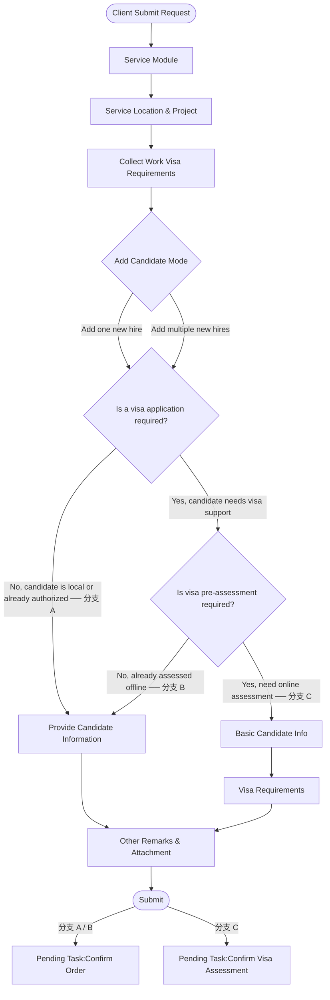

# 【Butter - EOR Onboarding】Submit Request 签证分流改造

***

## 1. 业务背景（Background）

- **现状 (As-Is)**：Client 创建 EOR Onboarding Request 时，在需要办理签证的情况下，无论候选人是否具有签证办理资格，都必须完整填写候选人入职信息后才能提交，签证资格判断在 SD 接单阶段才进行。
- **问题 (Pain)**：签证资格不明确时，Client 被迫提前填写大量完整 Onboarding 信息；若 SD 最终判断无法办理签证，整个 Request 成为无效流程，双方均浪费时间。
- **目标 (To-Be)**：在 Submit Wizard 中前置签证判断节点。不需要签证或不需要线上预评估的候选人，照常进入完整 Candidate Information 填写；需要线上预评估的候选人，只填写预评估所需的精简信息（Candidate Info + Visa Requirements），待 SD 评估通过后再补全正式 Onboarding 信息。
- **受影响角色**：Client HR / 客户联系人

**叙事**：过去 Client 每次创建 EOR Request，不论签证情况如何，都要先走完完整的候选人信息填写流程。对于签证资格尚不确定的 Expat，这意味着大量前期投入可能打水漂。本次在 Wizard 中增加签证判断分叉——Client 先回答"是否需要签证"和"是否需要线上预评估"，系统据此决定后续步骤。需要预评估的候选人只需填写轻量的评估信息即可提交，真正繁重的 Onboarding 信息留到评估通过后再填，有效避免无效流程。

***

## 2. 本卡范围（Scope）

- **适用角色**：Client HR / 客户联系人
- **适用场景**：单人模式下创建 EOR Onboarding Request 的完整 Submit Wizard 流程（含签证分流判断和预评估表单填写）
- **入口**：Request 列表页 → `Submit Request` 
- **主流程**：
  1. Service Module（沿用现有）
  2. Service Location & Project（沿用现有）
  3. `Collect Work Visa Requirements` — Add Candidate Mode 选择
  4. `Collect Work Visa Requirements` — Visa Application Type 判断（三条分支）
  5. 分支 C：`Basic Candidate Info` 子步骤 → `Visa Requirements` 子步骤
  6. `Other Remarks & Attachment`
  7. Submit
- **Out of scope**：
  - 批量模式（`Add multiple new hires`）——见 Story 4
  - SD Confirm Visa Assessment 审核流程——见 Story 2
  - 预评估通过后的 Complete Onboarding Info 和 Confirm Order——见 Story 3

***

## 3. 业务流程（Business Flow）



***

## 4. 用户故事（User Story）

> 作为 **Client HR**，我希望在创建 EOR Onboarding Request 时先完成签证需求判断，并在需要预评估时只填写精简的评估信息提交，以便于 SD 在正式接单前先完成签证资格审核，避免为签证资格不确定的候选人填写无效的完整入职信息。

***

## 5. Story AC（验收标准）

### 逻辑明细（Details）

#### (1) 页面结构 / 信息架构

**Wizard 主步骤结构**（动态，根据分支变化）：

```
1. Service Module
2. Service Location & Project
3. Collect Work Visa Requirements
   └─ 3.1 Add Candidate Mode
   └─ 3.2 Visa Application Type
   └─ 3.3 Candidate Info        ← 仅分支 C 展示
   └─ 3.4 Visa Requirements     ← 仅分支 C 展示
4. Provide Candidate Information ← 仅分支 A / B 展示
5. Other Remarks & Attachment
6. Submit
```

**Add Candidate Mode 页**：同当前

**Visa Application Type 页**（进入后展示左侧小步骤导航）：

- 提示文案：`Please confirm whether the candidate you are onboarding is local or expat. If the candidate is an expat and requires work authorization, please apply for a visa for this candidate.`

#### (2) 关键字段（Attribute）

**分支说明**（后续字段表和规则中的"分支 A/B/C"均指以下三种路径）：

| 分支       | 触发条件                                                                   | 后续步骤                                                              |
| :------- | :--------------------------------------------------------------------- | :---------------------------------------------------------------- |
| **分支 A** | 选 `No, candidate is local or already authorized`                       | → Provide Candidate Information → Other Remarks & Attachment      |
| **分支 B** | 选 `Yes, candidate needs visa support` + `No, already assessed offline` | → Provide Candidate Information → Other Remarks & Attachment      |
| **分支 C** | 选 `Yes, candidate needs visa support` + `Yes, need online assessment`  | → Candidate Info → Visa Requirements → Other Remarks & Attachment |

***

| 步骤                         | 字段                                             | 类型                                                                                     | 必填 | 展示条件                        | 说明                                                                          |
| :------------------------- | :--------------------------------------------- | :------------------------------------------------------------------------------------- | :- | :-------------------------- | :-------------------------------------------------------------------------- |
| Visa Application Type      | `Is a visa application required?`              | Radio· Yes, candidate needs visa support· No, candidate is local or already authorized | 是  | 始终                          | 判断候选人是否需要办理签证                                                               |
| Visa Application Type      | `Which type of visa do you need to apply for?` | Radio· Employment Visa· Dependant Visa· Employment + Dependant                         | 是  | `visa required = Yes`（单人模式） | 签证申请类型；批量模式下不展示此字段，改在候选人维度的 Visa Requirements 列表填写                          |
| Visa Application Type      | `Is visa pre-assessment required?`             | Radio· Yes, need online assessment· No, already assessed offline                       | 是  | `visa required = Yes`       | 是否需要走线上预评估                                                                  |
| Basic Candidate Info       | Basic Candidate Info 字段集                       | —                                                                                      | —  | 分支 C                        | 字段由底层 Attribute 配置中标记 `Used for Visa Assessment = true` 的字段动态渲染。详见 Story 5。 |
| Visa Requirements          | Visa Requirements 字段集                          | —                                                                                      | —  | 分支 C                        | 沿用当前签证预评估表单字段（Visa Info、Evaluation Materials 等），无变更。                        |
| Other Remarks & Attachment | Other Remarks                                  | Text                                                                                   | 否  | 始终（三条分支均有）                  | Client 补充说明                                                                 |
| Other Remarks & Attachment | Attachment                                     | File Upload                                                                            | 否  | 始终（三条分支均有）                  | Client 上传补充附件                                                               |

#### (3) 规则逻辑（核心）

**分支 A — 不需要办理 visa**：

- `Is visa required? = No`
- `Visa Application Type` 和 `Is pre-assessment required?` 不展示
- 后续步骤：`Provide Candidate Information` → `Other Remarks & Attachment` → Submit
- 提交后 Pending Task：`Confirm Order [EoR - Onboarding]`

**分支 B — 需要办理 visa，不需要预评估**：

- `Is visa required? = Yes` + `Is pre-assessment required? = No`
- 不展示 Candidate Info / Visa Requirements 子步骤
- 后续步骤：`Provide Candidate Information` → `Other Remarks & Attachment` → Submit
- 提交后 Pending Task：`Confirm Order [EoR - Onboarding]`

**分支 C — 需要办理 visa，且需要预评估**：

- `Is visa required? = Yes` + `Is pre-assessment required? = Yes`
- 不展示 `Provide Candidate Information` 步骤
- 后续步骤：`Basic Candidate Info` → `Visa Requirements` → `Other Remarks & Attachment` → Submit
- 提交后 Pending Task：`Confirm Visa Assessment`

**Visa Requirements 子步骤内容层级**（分支 C）：

```
Employment Visa（当 Visa Application Type 含 Employment）
  └─ Visa Info（Employment Visa Type / Within the Issuing Country/Region? / 申请地 / 出发地）
  └─ Evaluation Materials
  └─ Confirm Document Checklist

Dependant Visa（当 Visa Application Type 含 Dependant）
  └─ Dependent Info（Dependent Name / Relationship / Nationality / Current Residence）
  └─ Visa Info（Dependent Visa Type / Within the Issuing Country/Region? / 申请地 / 出发地）
  └─ Evaluation Materials
  └─ Confirm Document Checklist
```

**字段联动**：

- `Is visa required?` 由 Yes 切回 No → 清空 `Which type of visa do you need to apply for?`、`Is pre-assessment required?`，Wizard 步骤恢复分支 A 结构（移除 Basic Candidate Info / Visa Requirements 子步骤，展示 Provide Candidate Information）
- `Is pre-assessment required?` 由 `Yes, need online assessment` 切换为 `No, already assessed offline` → Wizard 步骤变为分支 B 结构（移除 Basic Candidate Info / Visa Requirements 子步骤，展示 Provide Candidate Information）；反向切回 Yes 时，恢复分支 C 结构
- `Which type of visa do you need to apply for?` 变更 → Visa Requirements 子步骤中 Employment Visa / Dependant Visa tab 显隐联动

<br />

***

### 验收清单（Acceptance Criteria）

**场景 – 主路径（Happy Path）**

- AC1：进入 `Collect Work Visa Requirements` 后，首先展示 Add Candidate Mode 选择页，左侧无小步骤导航；选择 `Add one new hire` 并点击 `Next` 后，进入 `Visa Application Type`，左侧展示小步骤导航
- AC2：分支 A — 选择 `Is visa required? = No` 后，Wizard 跳至 `Provide Candidate Information`，不展示 Candidate Info / Visa Requirements 子步骤；提交后 Pending Task 为 `Confirm Order [EoR - Onboarding]`
- AC3：分支 B — 选择 `Is visa required? = Yes` + `Is pre-assessment required? = No` 后，Wizard 跳至 `Provide Candidate Information`，不展示预评估子步骤；提交后 Pending Task 为 `Confirm Order [EoR - Onboarding]`
- AC4：分支 C — 选择 `Is visa required? = Yes` + `Is pre-assessment required? = Yes` 后，Wizard 进入 `Candidate Info` → `Visa Requirements` 子步骤，跳过 `Provide Candidate Information`；提交后 Pending Task 为 `Confirm Visa Assessment`
- AC5：分支 C — `Work Location` 变更后，`Visa Requirements` 中的 Evaluation Materials 材料清单自动刷新
- AC6：分支 C — 选择 `Visa Application Type = Employment + Dependant` 时，Visa Requirements 步骤同时展示 Employment Visa 和 Dependant Visa 两部分内容

**场景 – 异常路径（Edge Cases）**

- AC1：Add Candidate Mode 未选择时，`Next` 不可点击
- AC2：`Visa Application Type` 必填字段未填时，`Next` 不可点击
- AC3：分支 C 必填 Evaluation Materials 未上传时，Submit 被阻止并提示错误
- AC4：`Is visa required?` 由 Yes 切回 No 后，已填写的 `Visa Application Type` 值被清空，Wizard 步骤结构恢复为分支 A
- AC5：目标地区无预设材料配置时，展示对应提示文案，不阻止提交

