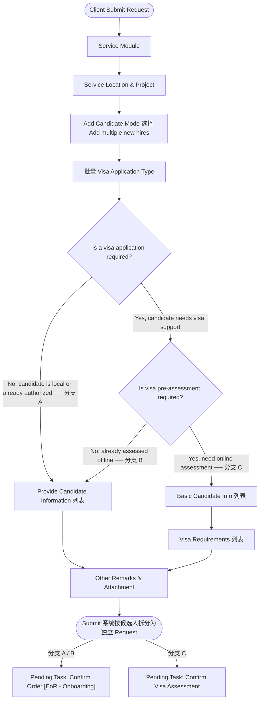

# 【Butter - EOR Onboarding】批量候选人签证评估提交

***

## 1. 业务背景（Background）

- **问题 (Pain)**：同一批次的多名 Expat 候选人若需要签证预评估，Client 需逐个提交 Request，填写重复的 Service Module、Service Location 等公共信息，耗时且容易遗漏。
- **目标 (To-Be)**：Client 可在一次 Submit Request 操作中添加多个候选人；提交后系统按候选人维度自动拆分为多个独立 Request，每个候选人各自进入对应的后续流程（预评估或直接 Confirm Order），互不干扰。
- **受影响角色**：Client HR / 客户联系人

**叙事**：对于同时引进多名海外员工的客户，逐个建单的模式意味着反复填写相同的项目和服务地信息，极其低效。本次批量模式让 Client 在一次提交中录入所有候选人的预评估信息，系统在提交后自动完成拆分建单，保留每个候选人独立流转的完整权利，同时避免某个候选人的状态变更影响同批其他人。

***

## 2. 本卡范围（Scope）

- **适用角色**：Client HR / 客户联系人
- **适用场景**：选择 `Add multiple new hires` 后的批量候选人签证评估提交全流程
- **入口**：Submit Request Wizard → Add Candidate Mode → 选择 `Add multiple new hires`
- **主流程**：
  1. Client 选择 `Add multiple new hires`，进入批量 `Visa Application Type`
  2. Client 判断整批候选人是否需要 visa / 是否需要预评估（三条分支）
  3. 分支 C（需要 visa + 需要预评估）：`Basic Candidate Info` 列表 → `Visa Requirements` 列表
  4. 分支 A/B（不需要预评估）：`Provide Candidate Information` 列表
  5. `Other Remarks & Attachment` → Submit
  6. 系统按候选人拆分为多个 Request，各自独立流转
- **Out of scope**：
  - 单人模式——见 Story 1
  - 拆分后每个 Request 的 SD 审核、Complete Onboarding Info、Confirm Order——见 Story 2、Story 3

***

## 3. 业务流程（Business Flow）



***

## 4. 用户故事（User Story）

> 作为 **Client HR**，我希望在一次 Submit Request 操作中添加多个候选人并批量提交签证预评估信息，以便于系统自动为每个候选人生成独立的 Request 并进入对应流程，而不需要我逐个重复建单。

***

## 5. Story AC（验收标准）

### 逻辑明细（Details）

#### (1) 页面结构 / 信息架构

**批量模式 Wizard 主步骤结构**：

```
1. Service Module
2. Service Location & Project
3. Collect Work Visa Requirements
   └─ 3.1 Add Candidate Mode（选择 Add multiple new hires）
   └─ 3.2 Visa Application Type
   └─ 3.3 Basic Candidate Info    ← 仅分支 C 展示
   └─ 3.4 Visa Requirements       ← 仅分支 C 展示
4. Provide Candidate Information  ← 仅分支 A / B 展示（列表形式）
5. Other Remarks & Attachment
6. Submit
```

**分支说明**（后续字段表和规则中的"分支 A/B/C"均指以下三种路径）：

| 分支       | 触发条件                                                                   | 后续步骤                                                                          |
| :------- | :--------------------------------------------------------------------- | :---------------------------------------------------------------------------- |
| **分支 A** | 选 `No, candidate is local or already authorized`                       | → Provide Candidate Information 列表 → Other Remarks & Attachment               |
| **分支 B** | 选 `Yes, candidate needs visa support` + `No, already assessed offline` | → Provide Candidate Information 列表 → Other Remarks & Attachment               |
| **分支 C** | 选 `Yes, candidate needs visa support` + `Yes, need online assessment`  | → Basic Candidate Info 列表 → Visa Requirements 列表 → Other Remarks & Attachment |

***

**批量 Visa Application Type 页**：

- 说明文案：Please confirm whether the candidates you are onboarding are local or expat. If the candidates are expats and require work authorization, please apply for visas for this group. If visa support is required, please also confirm whether this group needs visa pre-assessment.
- 字段
  | 字段                                 | 类型                                                                                       | 必填 | 展示条件                  | 说明                                 |
  | :--------------------------------- | :--------------------------------------------------------------------------------------- | :- | :-------------------- | :--------------------------------- |
  | `Is a visa application required?`  | Radio · Yes, candidate needs visa support · No, candidate is local or already authorized | 是  | 始终                    | 整批判断                               |
  | `Is visa pre-assessment required?` | Radio · Yes, need online assessment · No, already assessed offline                       | 是  | `visa required = Yes` | 整批判断；批量模式下不选 visa application type |
- 页面内部按钮：`Continue`

**Basic Candidate Info 列表页**（分支 C）：

- 标题：`Basic Candidate Info`
- 副文案：`Total X candidates added for visa pre-assessment.`
- 右上角操作：`Import`（Excel 批量导入）/ `Add`（手动新增）
- 列表字段：由 Attribute 配置中标记 `Used for Visa Assessment = true` 的字段动态渲染（详见 Story 5），末尾固定展示 Operation 列（Edit / Remove）
- 页面内部按钮：`Back / Continue`

**Visa Requirements 列表页**（分支 C）：

- 标题：`Visa Requirements`
- 副文案：`Total X candidates require visa pre-assessment.`
- 候选人名单来自 Basic Candidate Info
- 列表字段：Name / Which type of visa do you want to apply for? / Employment Visa Type / Within the Issuing Country/Region? / Country/Region at the time of Visa application / Departure Country/Region before entering Visa Location / Evaluation Materials / Operation
  - 具体交互可参考当前批量模式候选人签证信息收集

**批量 Provide Candidate Information 列表页**（分支 A / B）：

- 标题：`Provide Candidate Information`
- 副文案：`Total X candidates added to this order.`
- 右上角操作：`Select`/ `Import` / `Add`
- 列表字段：参考当前批量模式下候选人信息字段

#### (2) 规则逻辑（核心）

**分支判断**（整批共用）：

| 选择                  | 后续步骤                                        | 提交后每个候选人流向                |
| :------------------ | :------------------------------------------ | :------------------------ |
| 分支 A：不需要 visa       | Provide Candidate Information 列表            | `Confirm Order`           |
| 分支 B：需要 visa，不需要预评估 | Provide Candidate Information 列表            | `Confirm Order`           |
| 分支 C：需要 visa，且需要预评估 | Basic Candidate Info + Visa Requirements 列表 | `Confirm Visa Assessment` |

**提交后拆分规则**：

- 每个候选人生成一个独立的 Request
- 每个 Request 继承本次提交的 Service Module、Service Location、Project、Other Remarks、Attachment
- 拆分后各 Request 独立流转，互不影响

  <br />

***

### 验收清单（Acceptance Criteria）

**场景 – 主路径（Happy Path）**

- AC1：在 Add Candidate Mode 页选择 `Add multiple new hires` 后点击 `Next`，进入批量 `Visa Application Type` 步骤，该步骤不展示 `Which type of visa do you need to apply for?`
- AC2：分支 A/B — 进入批量 `Provide Candidate Information` 列表，支持 Select / Import / Add；提交后每个候选人生成独立 Request，Pending Task 均为 `Confirm Order [EoR - Onboarding]`
- AC3：分支 C — 依次进入 `Basic Candidate Info` 列表和 `Visa Requirements` 列表；`Basic Candidate Info` 支持 Import / Add；`Visa Requirements` 不展示 Import / Add，候选人来自上一步
- AC4：分支 C — `Visa Requirements` 列表中每行支持 inline 编辑；点击 `Edit` 打开该候选人的 visa requirements 明细页
- AC5：分支 C — 提交后每个候选人生成独立 Request，Pending Task 均为 `Confirm Visa Assessment`；Request 列表不展示批次关系
- AC6：`Other Remarks & Attachment` 中填写的备注和附件，被每个拆分后的 Request 共同继承
- AC7：Operation 列在横向滚动时固定在表格右侧，始终可见

**场景 – 异常路径（Edge Cases）**

- AC1：批量列表为空时，`Next` / Submit 不可点击，提示需至少添加一个候选人
- AC2：某候选人必填字段缺失时，对应行标红，Submit 被阻止
- AC3：Excel 导入包含格式错误行时，展示错误明细，合法行可正常预览导入
- AC4：`Visa Requirements` 列表中某候选人的必填 Evaluation Materials 未上传，该行 `Evaluation Materials` 列显示 `Missing`，Submit 时阻止并提示
- AC5：点击 `Remove` 移除某候选人后，剩余候选人数量在副文案中实时更新（`Total X candidates`）

