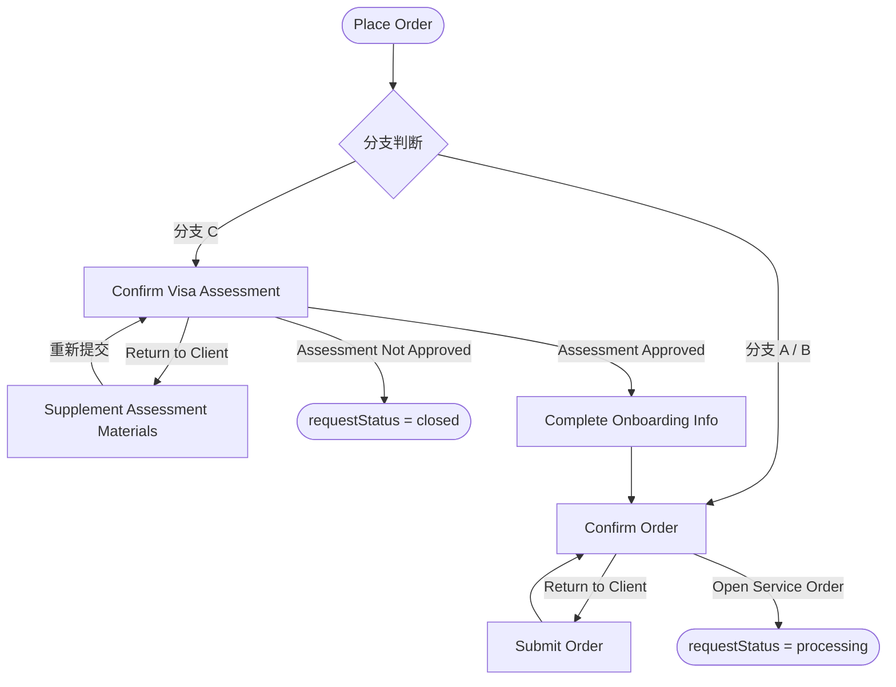

# 【Butter - EOR Onboarding】签证预评估基础配置：Attribute 标记与 Request Flow 节点改造

***

## 1. 业务背景（Background）

- **现状 (As-Is)**：
  1. EOR System Attributes 的字段通过 `required`、角色访问控制、`applicable service versions` 等维度控制字段展示和行为，但没有"是否用于签证预评估"这一维度。
  2. EOR Onboarding Request Flow 在 Open Service Order 前仅包含四个节点（Place Order → Submit Order → Confirm Order → Open Service Order），没有签证预评估审核所需的中间节点。
- **问题 (Pain)**：
  1. 不同国家/地区签证评估所需候选人信息存在差异，写死字段无法满足后续按地区差异化配置的需求；运营人员无法在不改代码的情况下增减预评估候选人信息字段。
  2. 现有 Request Flow 无法容纳签证预评估链路，导致签证预评估和后续流转缺乏系统支撑。
- **目标 (To-Be)**：
  1. 在 EOR System Attributes 中新增 `Used for Visa Assessment` 开关，PM 可通过配置界面标记哪些字段用于签证预评估；前端签证预评估 Candidate Info 步骤动态读取该标记进行字段渲染。
  2. 在 Request Flow 中新增签证预评估相关节点（Confirm Visa Assessment、Supplement Assessment Materials、Complete Onboarding Info），并明确各阶段 requestStatus 与 pendingTask。
- **受影响角色**：PM（配置侧）；Client HR、SD

**叙事**：本次在两个维度上为签证预评估功能打下基础：一是在 Attribute 配置层引入 `Used for Visa Assessment` 开关，让 PM 像管理其他字段属性一样管理签证评估所需字段，勾选即生效；二是在 Request Flow 中扩展节点结构，让预评估审核链路有完整的流程节点和状态支撑，避免签证资格不明确时产生无效 onboarding Request。

***

## 2. 本卡范围（Scope）

- **适用角色**：PM（Attribute 配置）；系统（Request Flow 节点扩展）
- **适用场景**：
  1. 在 EOR System Attributes 管理页维护签证预评估候选人信息字段集
  2. 为签证预评估功能扩展 EOR Onboarding Request Flow 节点与状态
- **入口**：Axis → System Attributes / Location Attributes → EOR Tab → V2 Tab → 属性列表 / 属性编辑表单
- **主流程**：
  1. PM 进入 EOR System Attributes 管理页，查看 / 编辑 / 批量更新 `Used for Visa Assessment` 标记
  2. 前端签证预评估 Candidate Info 步骤动态读取已标记字段并渲染
  3. 分支 C（visaAssessmentRequired = true）提交后，Request 进入新增节点：Confirm Visa Assessment →（可选 Supplement Assessment Materials 循环）→ Complete Onboarding Info → Confirm Order → Open Service Order
  4. 分支 A/B 的 Request Flow 保持原有路径不变

***

## 3. 业务流程（Business Flow）

**Request Flow 节点扩展**：

***

## 4. 用户故事（User Story）

> 作为 **PM**，我希望能在 EOR System Attributes 管理页为每个属性配置"是否用于签证预评估"的开关，以便于系统根据配置动态渲染签证预评估的候选人信息字段，而不需要通过代码发布来调整预评估表单的字段集。

> 作为**系统**，需要在 EOR Onboarding Request Flow 中扩展签证预评估相关节点，确保分支 C 的 Request 能够在 Confirm Visa Assessment、Supplement Assessment Materials、Complete Onboarding Info 等节点间正确流转，并维护各阶段的 requestStatus 与 pendingTask。

***

## 5. Story AC（验收标准）

### 逻辑明细（Details）

#### (1) 页面结构 / 信息架构

**System Attributes 属性列表**：

- 在现有 Assess Setting 分组下的最后边新增 `Used for Visa Assessment` 列列值展示：`Yes` / `No`
- 该列仅在 EOR V2 Tab 下展示
- 默认值：`No`
- 属性显示 Tooltips：该字段用于控制客户下入职订单时的签证预评估字段

**Batch Update**：

- 现有批量更新（`BatchUpdateDialog`）中新增 `Used for Visa Assessment` 字段，支持批量将多个属性的该标记设为 `Yes `或 `No`

**System 同步到 Location**：

- `usedForVisaAssessment` 字段纳入现有 System → Location 同步字段范围（`SyncAttributeFields`），与其他字段同步规则一致

#### (3) 规则逻辑（Attribute 配置）

**配置侧**：

- PM 在编辑表单中开启/关闭 `Used for Visa Assessment` 开关后点击保存，立即生效
- Batch Update 中批量修改后，批量写入对应属性记录

**消费侧（签证预评估 Candidate Info 步骤）**：

- 前端通过 Schema 查询接口获取 EOR V2 System Attributes（或对应 Location Attributes）
- 过滤 `usedForVisaAssessment = yes `的字段，按字段在 schema 中的排序渲染 Candidate Info 表单
- 若无任何字段标记为 `true`，Candidate Info 步骤展示空状态提示（`No fields configured for visa assessment. Please contact your administrator.`）

**版本归属**：

- 本期只在 EOR V2（`systemIdV2`）层面配置；

#### (4) Request Flow 节点改造

**新增节点（分支 C）**：

| 节点                              | 操作方      | 触发条件                                                |
| :------------------------------ | :------- | :-------------------------------------------------- |
| Confirm Visa Assessment         | SD       | 分支 C：Client 提交预评估 Request 后                         |
| Supplement Assessment Materials | Client   | SD 在 Confirm Visa Assessment 选择 Return to Client    |
| Complete Onboarding Info        | Client / | SD 在 Confirm Visa Assessment 选择 Assessment Approved |

**Request Status 说明**：

顶层 `requestStatus` 在整个预评估流程中统一保持 `pending`，不同阶段通过 `pendingTask` 区分。仅以下两种情况例外：

| 事件                         | requestStatus |
| :------------------------- | :------------ |
| SD Assessment Not Approved | `closed`      |
| SD Open Service Order      | `processing`  |

**各阶段节点状态对照**：

分支 A / B（不需要预评估）：

| 节点                                 | requestStatus | pendingTask                        |
| :--------------------------------- | :------------ | :--------------------------------- |
| Client Submit Request              | `pending`     | `Confirm Order [EoR - Onboarding]` |
| SD Return to Client（Confirm Order） | `pending`     | `Submit Order`                     |
| SD Open Service Order              | `processing`  | —                                  |

分支 C（需要线上预评估）：

| 节点                                 | requestStatus | pendingTask                        |
| :--------------------------------- | :------------ | :--------------------------------- |
| Client Submit Request（提交预评估信息）     | `pending`     | `Confirm Visa Assessment`          |
| SD Return to Client（预评估）           | `pending`     | `Supplement Assessment Materials`  |
| Client 补料重提                        | `pending`     | `Confirm Visa Assessment`          |
| SD Assessment Not Approved         | `closed`      | —                                  |
| SD Assessment Approved             | `pending`     | `Complete Onboarding Info`         |
| Client 提交 Complete Onboarding Info | `pending`     | `Confirm Order [EoR - Onboarding]` |
| SD Return to Client（Confirm Order） | `pending`     | `Submit Order`                     |
| SD Open Service Order              | `processing`  | —                                  |

#### (5) 异常 & 提示

- 如果 PM 将所有预评估字段的 `Used for Visa Assessment` 关闭，导致 Candidate Info 步骤无字段可渲染，前端展示空状态提示，不阻止配置保存，但建议 PM 保持至少一个字段开启
- Batch Update 时，若选中属性中包含不支持该字段的类型，后端返回对应属性的跳过记录，前端展示操作结果摘要

#### (6) 权限（Permission）

- 仅 PM 可查看和修改 `Used for Visa Assessment` 配置
- SD 和 Client 不可见该配置项
- 配置变更不需要审批，保存即生效

***

### 验收清单（Acceptance Criteria）

**场景 – Attribute 配置（Happy Path）**

- AC1：EOR System Attributes 属性列表新增 `Used for Visa Assessment` 列，展示每个属性的当前标记状态（Yes / No）
- AC2：进入单个属性编辑表单，在业务适用性区域能看到 `Used for Visa Assessment` 开关，默认为关闭（false）
- AC3：PM 开启开关并保存后，属性列表对应行的 `Used for Visa Assessment` 列更新为 `Yes`
- AC4：Batch Update 弹窗中展示 `Used for Visa Assessment` 字段，支持批量设为开启或关闭
- AC5：Schema 查询接口返回结果中包含 `usedForVisaAssessment` 字段
- AC6：签证预评估 Candidate Info 步骤只渲染 `usedForVisaAssessment = true` 的字段，且按 schema 中的字段排序展示
- AC7：System Attributes 同步到 Location 时，`usedForVisaAssessment` 字段随其他字段一起同步

**场景 – Attribute 配置（Edge Cases）**

- AC1：所有属性的 `Used for Visa Assessment` 均为 false 时，签证预评估 Candidate Info 步骤展示空状态提示，不展示空表单
- AC2：Batch Update 批量操作部分属性不支持该字段时，前端展示操作结果摘要，列明成功和跳过的属性数量
- AC3：新建属性时，`Used for Visa Assessment` 开关默认为关闭，不会意外将新字段加入预评估表单

**场景 – Request Flow 节点（Happy Path）**

- AC8：分支 A/B 提交后，Request pendingTask 为 `Confirm Order [EoR - Onboarding]`，requestStatus 为 `pending`
- AC9：分支 C 提交后，Request pendingTask 为 `Confirm Visa Assessment`，requestStatus 为 `pending`
- AC10：SD Return to Client（预评估）后，pendingTask 更新为 `Supplement Assessment Materials`
- AC11：Client 补料重提后，pendingTask 重新变为 `Confirm Visa Assessment`
- AC12：SD Assessment Not Approved 后，requestStatus 变为 `closed`
- AC13：SD Assessment Approved 后，pendingTask 变为 `Complete Onboarding Info`
- AC14：Client 提交 Complete Onboarding Info 后，pendingTask 变为 `Confirm Order [EoR - Onboarding]`
- AC15：SD Open Service Order 后，requestStatus 从 `pending` 变为 `processing`

